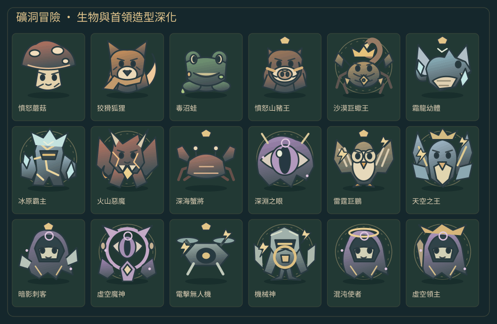
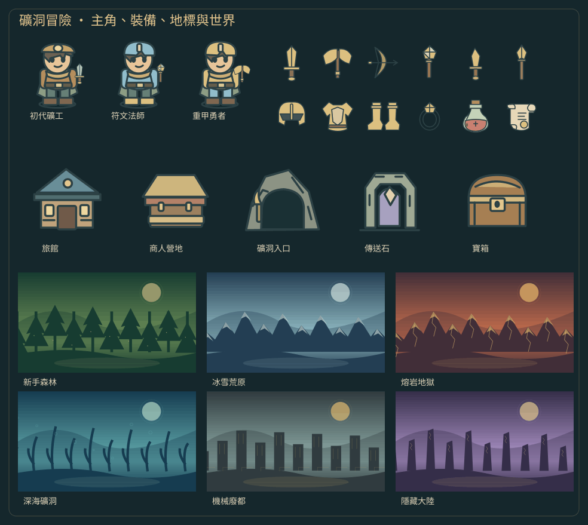
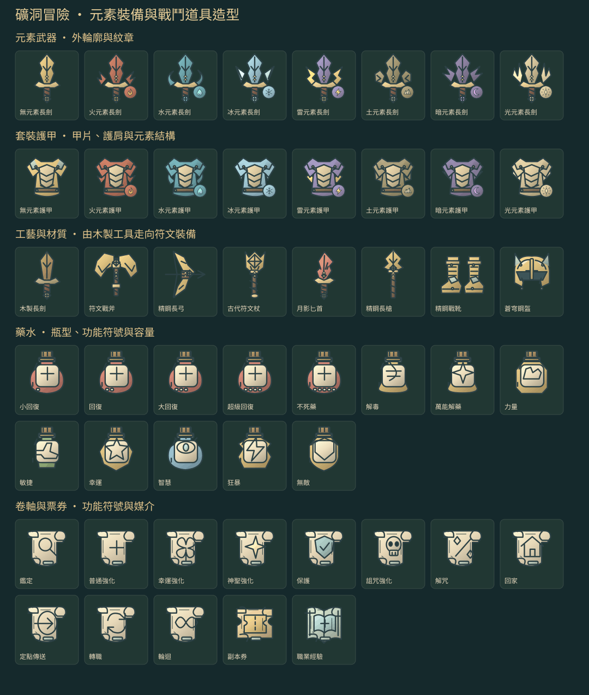
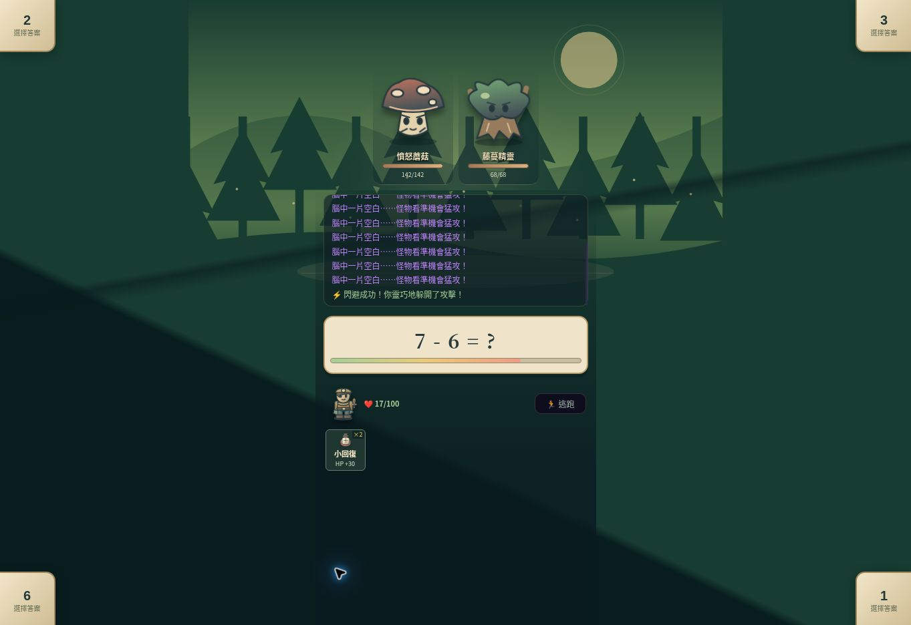

# 礦洞冒險：完整美術深化與戰鬥修正

此版使用墨綠、黃銅、羊皮紙色的冒險手冊視覺。地圖、戰鬥、圖鑑、背包、裝備、地標與傳承介面使用同一套原創向量插畫。

| 範圍 | 改版內容 |
| --- | --- |
| 生物 | 75 種具名造型設定，以 30+ 物種結構、材質、配色、紋飾與首領裝飾組成；蠍、蜘蛛、蟹、魚、龍、狐狸、熊、野豬和機械有不同輪廓 |
| 首領 | 巨蠍王、冰原霸主、火山惡魔、深淵之眼、天空之王、虛空魔神、機械神、混沌使者、虛空領主等的專屬組合 |
| 主角 | 礦工帽、頭盔、披肩、護甲、腰帶、靴子與六類武器；裝備品質同步改變配色；地圖依行走方向朝向 |
| 裝備 | 六類武器、護甲各部位、戒指、項鍊、耳環、藥水、卷軸與未鑑定物品 |
| 世界 | 九大陸背景；森林、沙漠、冰雪、熔岩、海底、天空、暗影、機械、虛空的地面與植被特色 |
| 地標 | 旅館、商人營地、礦洞入口、寶箱、傳送石；地下城使用相同主角與地標素材 |
| 戰鬥 | 呼吸待機、受擊閃光、命中爆光、首領場景；傷害數字依角色位置顯示；尊重減少動畫設定 |
| 介面 | 自訂選單圖示、黃銅物品框、人物肖像、死亡與傳承視覺；音效按鈕可點擊；世代徽章置於遊戲頂列 |

## 查看美術

開啟 `games/dungeon-artbook.html` 可搜尋、按大陸篩選 75 種生物，查看九大陸、主角換裝、地標與不同品質的道具。畫冊不讀寫遊戲存檔。

[完整生物素材表](dungeon-bestiary-atlas.png)。上述 PNG 為素材預覽，並非遊戲畫面截圖。

## 戰鬥修正

答題速度依實際經過時間計算；後續回合推進與冷卻/狀態倒數；單體技能需擊敗全部怪物才結算；元素依實際攻擊目標判定；擊殺數按敵人數計算；移除重複初始化。舊存檔補上預設欄位，SAVE_VERSION 保持 3。

## 驗證

- `node tests/dungeon-regression.cjs`：計時、回合、冷卻、狀態、群體勝利、舊存檔和初始化。
- `node tests/dungeon-art-smoke.cjs`：完整遊戲程式初始化、地圖、背包、裝備、圖鑑、戰鬥、重複主角刷新、地下城與全怪物素材覆蓋；使用模擬 DOM 和原生 Canvas，無法驗證 CSS 排版。
- `node tests/dungeon-art-raster.cjs`：312 個 SVG 的實際轉圖與有效像素驗證（含全部元素裝備、藥水與卷軸）。
- `git diff --check`。

素材檢查需要 `@napi-rs/canvas` 和 `sharp`；ChatGPT runtime 可透過 `CODEX_PRIMARY_RUNTIME_NODE_MODULES` 使用已安裝依賴。素材 PNG 可由 `node scripts/render-dungeon-art.cjs` 重建；中文預覽字體使用系統 Noto Sans CJK TC。遊戲本身不需要 Node 或這些套件，素材與畫冊不依賴外部圖片/字體服務。

## 2026-10-04：戰鬥道具與元素裝備

戰鬥道具改用獨立 60×62px 按鈕（地圖維持較大按鈕），固定保留 24px 圖示、11px 名稱及 9px 效果文字，與數量分開。例如小回復／HP +30、力量／攻 +30%、不死藥／HP 全滿。兩列保留橫向捲動，文字不依賴 hover。素材網址增加版本參數，避免新 HTML 搭配舊 CSS。

造型依現有 `ELEMENTS`、`SET_DEFS` 與裝備名稱設計；本 repository 目前沒有獨立的詳細元素 MD。以下是本次美術對照，並非新增技能或改變數值。

| 元素 | 現有套裝設定 | 裝備造型 |
| --- | --- | --- |
| 火 | 烈焰征服者：引燃、烈焰風暴 | 熔銅、向上火舌、分叉翼片、火焰紋章 |
| 水 | 深海支配者：反彈、洪流吞噬 | 潮汐弧片、海綠金屬、水滴、波浪 |
| 冰 | 霜龍王者：冰凍、絕對零度 | 多面冰晶、晶體尖刺、霜線、雪晶紋章 |
| 雷 | 雷帝神裁：鏈式傷害、雷神降臨 | 折線導電翼、電極、閃電紋章 |
| 土 | 大地守護者：再生、磐石不滅 | 厚岩甲片、礦石切面、山峰紋章 |
| 暗 | 深淵審判者：吸血、靈魂吞噬 | 鉤刺、缺口翼片、暗月紋章 |
| 光 | 聖光裁決者：淨化、神聖審判 | 放射翼片、象牙與金、光芒紋章；美術支援 light 與舊 holy 值 |
| 無 | 混沌破滅者／一般裝備 | 中性金屬與礦晶；不顯示元素徽章 |

六類武器新增護手、包纏握柄、晶核、刃脊與高品質的分叉／切口輪廓。護甲新增分節甲片、護膝、縫線、鉚釘和高階肩甲／盔角。木、皮、布材質使用暖褐與縫線；符文、水晶、月光類名稱增加晶核與刻紋。藥水依用途分成圓瓶、細頸瓶、多面瓶、異形瓶；卷軸保留功能符號，職業經驗改成書冊、副本券改成切口票券。待鑑定裝備不暴露元素或品質細節。

畫冊的「裝備與道具」可切換八種元素與品質，並收錄全部快捷藥水和十三種卷軸。名稱與劇情尚未改動，可在後續確定世界設定後整理。

## 驗證範圍

程式回歸、藥水名稱／效果／使用動作與 312 個 SVG 轉圖測試通過。正式站以瀏覽器實際進入雙怪戰鬥，確認 60×62px 按鈕內顯示小回復／HP +30／數量，並實際使用藥水，數量由 2 減到 1、回復提示出現。畫冊可切換冰元素並更新造型。大量藥水的手機戰鬥排版、觸控和完整冒險仍需實機驗證，桌面瀏覽器與模擬 DOM 測試無法代替此項。

